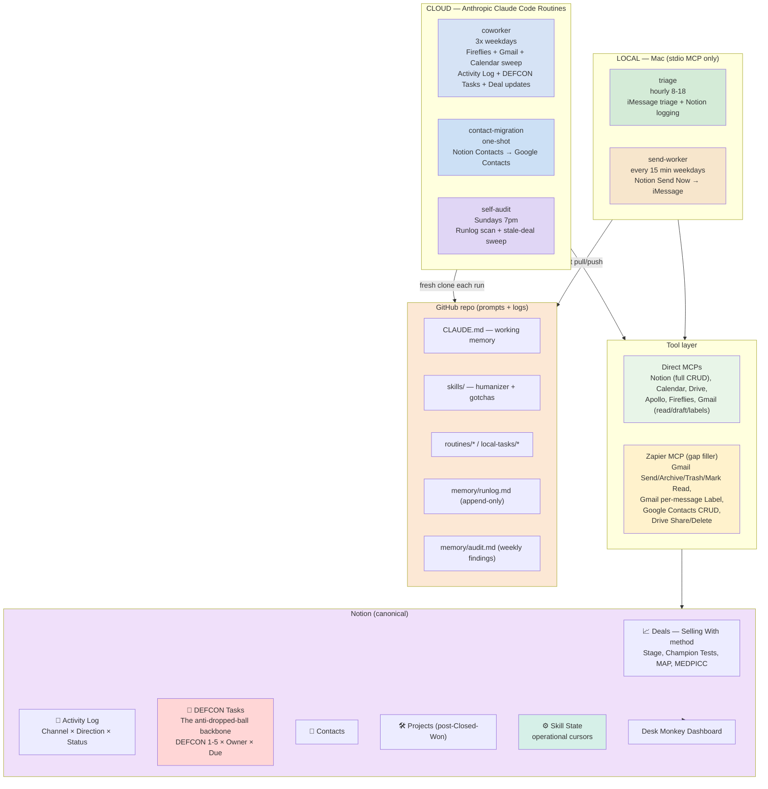

# Desk Monkey Architecture

Three-layer system. Notion is canonical state and dashboard. The repo holds prompts, voice rules, and append-only logs. Cloud routines do the heavy work; local Mac tasks handle iMessage which can't run in cloud.

## Data flow



## Why this split

**Local stays local because of stdio MCP.** iMessage MCP only runs as a local process. Cloud routines see only remote HTTP/SSE connectors. So anything iMessage-bound stays on the Mac.

**Cloud handles everything else.** Notion, Gmail, Calendar, Drive, Apollo, Fireflies all have remote MCPs. The coworker routine sweeps these on a 3x-weekday cadence.

## Tool layer rule

Direct MCPs primary, Zapier fills gaps. Read AND write with direct whenever it exists. Don't enable Zapier actions that duplicate direct MCP capability — burns context budget on every run AND consumes Zap task quota.

| Surface | Direct does | Zapier fills |
|---|---|---|
| Notion | full CRUD | nothing |
| Calendar | full CRUD + invites + suggest_time | nothing |
| Drive | read/create/copy/search/metadata | Share, Delete |
| Apollo | search + enrich + sequences | nothing |
| Fireflies | transcripts + summaries | nothing |
| Gmail | search, read, draft, labels (create/list only) | Send, Archive, Trash, Mark Read/Unread, Add/Remove per-message Label |
| Google Contacts | NOT WIRED | Create, Find, Update |

Note: Gmail per-message label MCPs (label_message, unlabel_*) are currently disconnected. Per-message labeling routes through Zapier until they return.

## Source of truth

Reality (Gmail / Calendar / Fireflies / iMessage) → Notion → repo memory files.

- **Notion is the database.** Activity Log, DEFCON Tasks, Deals, Contacts, Projects, Skill State. No Postgres. The data volume here doesn't justify it and adding a separate DB means sync hell.
- **Fireflies is the raw transcript archive.** Routines pull summaries via MCP and digest into Notion. Don't dump full transcripts into Notion.
- **Repo holds:** prompts, skills, append-only runlog, weekly audit findings. NOT operational cursors — those live in Notion's Skill State DB.

## Schedule

Cron strings live in the Anthropic routine UI, not in this repo. Listed here as documentation of intent.

| Job | Where | Suggested cadence |
|---|---|---|
| triage | Local Mac | hourly 8-18 |
| send-worker | Local Mac | */15 8-18 weekdays |
| coworker | Cloud | 3x weekdays (e.g. 7am, 12pm, 6pm) |
| contact-migration | Cloud | manual one-shot |
| self-audit | Cloud | Sundays 7pm |

## State management

Operational cursors (last_fireflies_id, last_gmail_sweep, contact_migration_completed_at, last_audit_week) live in **Notion Skill State DB** at `collection://7e0c32b3-112c-4bb0-b058-ee588e8ca921`. Each row: Key (string), Value (string), Skill (enum), Last Updated (auto), Notes.

Repo `memory/` holds only:
- `runlog.md` — append-only run history (every routine writes here)
- `audit.md` — weekly self-audit findings

This keeps state visible to Liam in his dashboard and removes git-merge-conflict risk on cursors.

## Repo sync contract

- **Cloud routines**: fresh clone → work → `git add memory/runlog.md && git commit && git push`. Cursors go to Notion, not git.
- **Local tasks**: `git pull --rebase` before, push runlog after.
- **Conflicts**: surface as Drift in runlog. Liam resolves manually.

## Repo structure

```
.
├── CLAUDE.md                          # auto-loaded into every session
├── README.md                          # operator setup doc
├── .mcp.json                          # local Claude Code config (Notion only; cloud connectors via routine UI)
├── architecture.md                    # this file
├── skills/
│   ├── humanizer.md                   # voice rules
│   └── gotchas.md                     # canonical hard rules
├── routines/
│   ├── coworker/{prompt.md,README.md}
│   ├── contact-migration/{prompt.md,README.md}
│   └── self-audit/{prompt.md,README.md}
├── local-tasks/
│   ├── triage/SKILL.md                # iMessage triage (Mac-only)
│   └── send-worker/SKILL.md           # iMessage send (Mac-only)
└── memory/
    ├── runlog.md                      # append-only
    └── audit.md                       # weekly findings
```

## Anti-dropped-ball logic

The whole system is designed around DEFCON Tasks as the action-item ledger.

**Sources of tasks:**
1. Meeting transcripts (coworker Step 1) — Liam-owned actions become Tasks; counterpart-owned commitments also become Tasks with Owner=blank.
2. Gmail unanswered (coworker Step 2) — counterpart silence >5 days creates a nudge Task.
3. Calendar lookahead (coworker Step 3) — meeting prep Tasks for tomorrow's externals.
4. Counterpart verification sweep (coworker Step 4) — daily check that counterpart-owned Tasks past Due actually got done; if not, creates a nudge Task for Liam.
5. Stale-deal sweep (self-audit weekly) — Deals with no Last Touch in 14d get a Follow-up Task.

**Closing the loop:**
- Liam's view: 🚨 DEFCON Tasks DB filtered by My Open Tasks, sorted by DEFCON ascending.
- Done = Status=Done. Killed = decided not to do. Blocked = waiting on someone, with Notes explaining what.
- The system never hides Tasks. They sit in Liam's dashboard until acted on.

## Deal flow (Selling With)

```
New → Discovery → Qualified → POC → Co-Building → Proposal → Negotiation → Procurement → Closed Won/Lost
```

Side states: Nurture, On Hold, Unresponsive.

**Stage gates** (don't auto-flip; coworker flags when met):
- Qualified gate: 3+ Champion Tests Passed
- Co-Building exit gate: Buyer-Owned Action Ratio ≥ 50%

**Closed Won** spawns a Project row; activity routes to Project, not Deal.
**Closed Lost / no-decision** writes a Deal Review / Autopsy on the Deal page.
