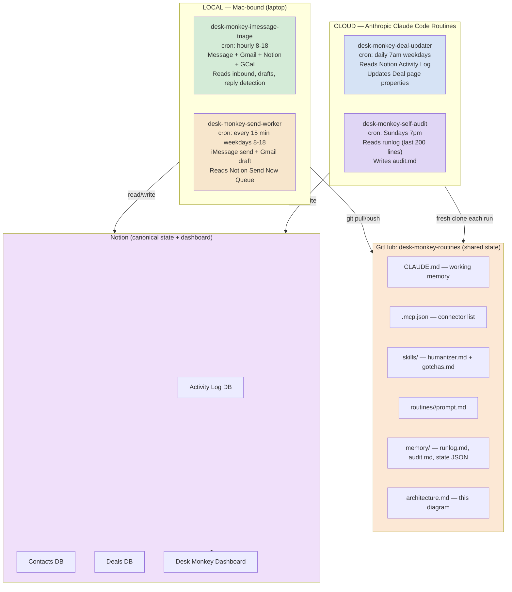

# Desk Monkey Architecture

Three-layer system. GitHub repo as the shared persistence layer between cloud routines and local Mac-bound tasks. Notion is canonical state and Liam's dashboard.

## Data flow



## Why this split

Local stdio MCPs (iMessage, Apple Notes, computer-use) only run as local processes. Cloud Claude Code routines see only remote HTTP/SSE connectors. So anything iMessage-bound stays local. Notion, Gmail, Google Calendar, Apollo are all remote-capable, so deal-updater and self-audit move to cloud routines. The repo is the shared state layer: cloud routines read/write `memory/runlog.md` directly via git; local tasks pull and push around their runs.

## Source of truth

Reality (iMessage / Gmail / Calendar) → Notion → repo memory files. Notion is the canonical record. Repo memory files are operational scratchpads for the routines themselves (runlog, audit findings, cross-run state).

## Cron schedule

| Job | Where | Cron | Purpose |
|---|---|---|---|
| desk-monkey-imessage-triage | Local Mac | `0 8-18 * * *` | Hourly inbound triage + draft generation |
| desk-monkey-send-worker | Local Mac | `*/15 8-18 * * 1-5` | Every 15 min weekdays — sends queued drafts |
| desk-monkey-deal-updater | Cloud routine | `0 7 * * 1-5` | Daily 7am — updates Deal page properties from yesterday's activity |
| desk-monkey-self-audit | Cloud routine | `0 19 * * 0` | Sundays 7pm — scans runlog, writes audit findings |

Local and cloud schedules don't overlap (cloud runs at 7am and 7pm-Sunday, local runs hourly during business hours). Runlog merge collisions should not happen in practice; if they do, audit logs Drift.

## Repo sync contract

- **Cloud routines**: fresh clone each run, write changes, commit, push. No long-lived state on the cloud side.
- **Local tasks**: `git pull --rebase origin main` before work, `git add memory/runlog.md && git commit && git push origin main` after.
- **Conflicts**: surfaced to runlog as Drift. Liam resolves manually. No auto-merge of conflicting runlog edits.

## Repo structure

```
desk-monkey-routines/
├── CLAUDE.md                          # auto-loaded into every session
├── README.md                          # operator docs
├── .mcp.json                          # MCP servers for cloud routines
├── architecture.md                    # this file
├── skills/
│   ├── humanizer.md                   # voice rules
│   └── gotchas.md                     # canonical rule list
├── routines/
│   ├── deal-updater/
│   │   ├── prompt.md
│   │   └── README.md
│   └── self-audit/
│       ├── prompt.md
│       └── README.md
├── local-tasks/
│   ├── triage/
│   │   └── SKILL.md                   # local — iMessage triage
│   └── send-worker/
│       └── SKILL.md                   # local — iMessage send worker
└── memory/
    ├── runlog.md                      # append-only run history
    ├── audit.md                       # weekly audit findings
    └── state.json                     # cross-run state
```
