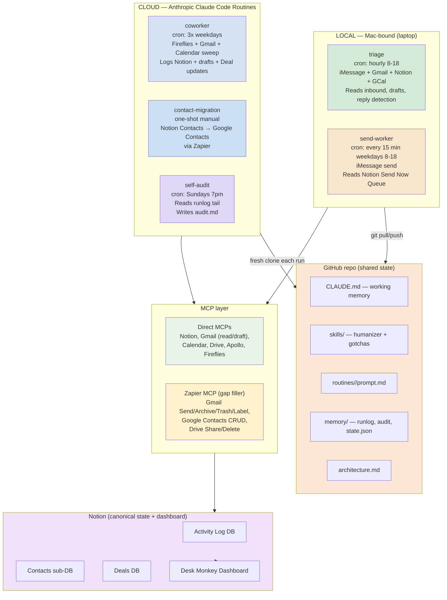

# Desk Monkey Architecture

Three-layer system. GitHub repo holds shared state (prompts, runlog, audit, cross-run cursors). Notion is canonical record + Liam's dashboard. Cloud routines do the heavy work; local Mac tasks handle iMessage which can't run in cloud.

## Data flow



## Why this split

**Local stays local because of stdio MCP.** iMessage MCP, Apple Notes MCP, computer-use MCP all run as local processes only. Cloud Claude Code routines see only remote HTTP/SSE connectors. So anything iMessage-bound stays on the Mac.

**Cloud handles everything else.** Notion, Gmail, Calendar, Drive, Apollo, Fireflies all have remote MCPs. The coworker routine sweeps these on a schedule. Repo is the persistence layer between runs (`memory/state.json` for cursors, `memory/runlog.md` for audit history).

## Tool layer

Direct MCPs are the primary surface. Zapier MCP wraps the gaps. Don't enable Zapier actions that duplicate direct MCP capability — every enabled Zapier action burns context budget on every run AND consumes Zap task quota.

| Surface | Direct MCP handles | Zapier fills |
|---|---|---|
| Gmail | search, read, draft, list/create labels | Send, Archive, Trash, Mark Read/Unread, Add/Remove Label on message |
| Calendar | full CRUD + invites + suggest_time | nothing |
| Drive | read/create/copy/search/metadata | Share, Delete (only if needed) |
| Google Contacts | NOT WIRED | Create, Find, Update |
| Notion | full CRUD | nothing |
| Apollo | full search + enrich + sequences | nothing |
| Fireflies | transcripts + summaries + search | nothing |

Note: Gmail label_message / label_thread / unlabel_* MCP tools are currently disconnected. Per-message labeling has to go through Zapier until those return.

## Source of truth

Reality (iMessage / Gmail / Calendar / Fireflies) → Notion → repo memory files.

- **Notion** is the canonical record. Activity Log + Contacts + Deals collections are the data layer. Dashboard is Liam's view.
- **Fireflies** is the raw transcript archive. Routines pull summaries from Fireflies and digest into Notion. Don't dump full transcripts into Notion.
- **Repo memory** holds operational state only: runlog, audit findings, cross-run cursors. Not business data.
- **No Postgres.** Notion is the database.

## Schedule

Cron strings live in the Anthropic routine UI, not in this repo. Listed here as documentation of intent.

| Job | Where | Suggested cadence | Purpose |
|---|---|---|---|
| triage | Local Mac | hourly 8-18 | Hourly inbound triage + draft generation (iMessage) |
| send-worker | Local Mac | */15 8-18 weekdays | Sends queued iMessage drafts on Send Now flag |
| coworker | Cloud routine | 3x weekdays (e.g. 7am, 12pm, 6pm) | Sweep Fireflies + Gmail + Calendar, log + draft |
| contact-migration | Cloud routine | manual one-shot | Migrate Notion Contacts to Google Contacts |
| self-audit | Cloud routine | weekly Sundays 7pm | Scan runlog, write audit findings |

Local and cloud schedules don't overlap in practice. Cloud runs at fixed weekday times, local runs hourly during business hours but offset. Runlog merge collisions should not happen; if they do, audit logs Drift.

## Repo sync contract

- **Cloud routines**: fresh clone each run → do work → `git add memory/ && git commit && git push origin main` at end.
- **Local tasks**: `git pull --rebase origin main` before work → do work → `git add memory/ && git commit && git push` after.
- **Conflicts**: surfaced to runlog as Drift. Liam resolves manually.

## Repo structure

```
.
├── CLAUDE.md                          # auto-loaded into every session
├── README.md                          # operator docs
├── .mcp.json                          # Notion connector for local Claude Code only
├── architecture.md                    # this file
├── skills/
│   ├── humanizer.md                   # voice rules
│   └── gotchas.md                     # canonical rule list
├── routines/
│   ├── coworker/
│   │   ├── prompt.md
│   │   └── README.md
│   ├── contact-migration/
│   │   ├── prompt.md
│   │   └── README.md
│   └── self-audit/
│       ├── prompt.md
│       └── README.md
├── local-tasks/
│   ├── triage/
│   │   └── SKILL.md                   # iMessage triage (placeholder)
│   └── send-worker/
│       └── SKILL.md                   # iMessage send worker (placeholder)
└── memory/
    ├── runlog.md                      # append-only run history
    ├── audit.md                       # weekly audit findings
    └── state.json                     # cross-run cursors + flags
```
