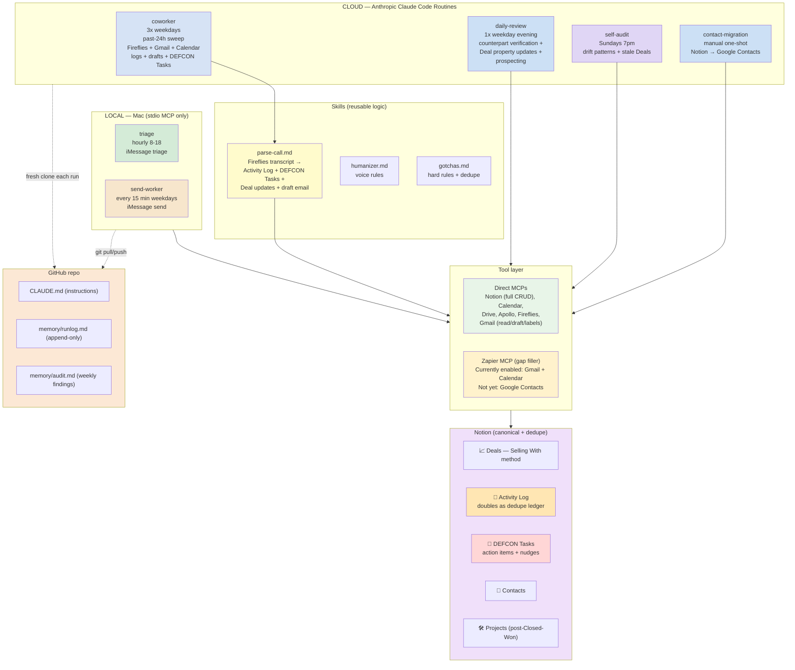

# Desk Monkey Architecture

Two-cadence cloud system + local Mac-bound tasks for iMessage. Notion is canonical state, dedupe ledger, and Liam's dashboard. The repo is the operational scratchpad.

## Data flow



## Two-cadence cloud loop

**Tactical (3x weekdays — `coworker`):** Past-24h sweep. New Fireflies transcripts, unanswered Gmail, tomorrow's meetings. Fast and narrow. Logs to Activity Log, creates DEFCON Tasks for action items, drops drafts in Gmail Drafts. No Deal property updates here — those live in daily-review.

**Strategic (1x weekday evening — `daily-review`):** Rollup. Counterpart commitment verification (DEFCON Tasks past Due with Owner=blank get checked for proof of completion; if missing, Liam-owned nudge tasks created). Deal property updates rolled up across the day's accumulated Activity Log entries. Left-on-read prospecting sweep.

This split keeps the tactical loop fast and the strategic loop bounded. Each runs on a different cadence. Together they're the whole brain.

## Activity Log doubles as dedupe ledger

No separate state.json or Skill State DB. The Activity Log itself answers "have I processed this?" Before processing a Fireflies transcript, query Activity Log for any Meeting row referencing that transcript URL. If found, skip. Same pattern for Gmail threads and Calendar events. Single source of truth for both data and idempotency.

Self-audit's idempotency is the audit.md file itself — check for an existing `## Week ending <date>` header before writing one.

Contact-migration's idempotency is an Activity Log Note row with Activity=`contact-migration completed`.

## Tool layer

Direct MCPs primary, Zapier fills gaps. Read AND write with direct whenever it exists.

| Surface | Direct does | Zapier fills |
|---|---|---|
| Notion | full CRUD | nothing |
| Calendar | full CRUD + invites + suggest_time | nothing |
| Drive | read/create/copy/search/metadata | Share, Delete |
| Apollo | search + enrich + sequences | nothing |
| Fireflies | transcripts + summaries | nothing |
| Gmail | search, read, draft, labels (create/list only) | Send, Archive, Trash, Mark Read/Unread, Add/Remove per-message Label |
| Google Contacts | NOT WIRED | Create, Find, Update (NOT YET ENABLED) |

Currently enabled in Liam's Zapier MCP config: Gmail + Google Calendar. Google Contacts needs to be added before contact-migration can run.

Note: Gmail per-message label MCPs (label_message, unlabel_*) are currently disconnected. Per-message labeling routes through Zapier until they return.

## Source of truth

Reality (Gmail / Calendar / Fireflies / iMessage) → Notion → repo memory files.

- **Notion**: Activity Log, DEFCON Tasks, Deals, Contacts, Projects.
- **Fireflies**: raw transcript archive. Routines pull summaries, never dump full transcripts.
- **Repo memory**: `runlog.md` (append-only history), `audit.md` (weekly findings). Nothing else.
- **No Postgres. No state.json.**

## Schedule

Cron strings live in the Anthropic routine UI, not in this repo. Listed here as documentation of intent.

| Job | Where | Suggested cadence |
|---|---|---|
| triage | Local Mac | hourly 8-18 |
| send-worker | Local Mac | */15 8-18 weekdays |
| coworker | Cloud | 3x weekdays (e.g. 7am, 12pm, 6pm) |
| daily-review | Cloud | 1x weekday evening (e.g. 6:30pm) |
| self-audit | Cloud | weekly Sundays 7pm |
| contact-migration | Cloud | manual one-shot |

## Repo sync contract

- **Cloud routines**: fresh clone → work → `git add memory/runlog.md memory/audit.md && git commit && git push`.
- **Local tasks**: `git pull --rebase` before, push runlog after.
- **Conflicts**: surface as Drift in runlog. Liam resolves manually.

## Repo structure

```
.
├── CLAUDE.md                         # auto-loaded; instructions, tool routing, schemas, NEVERs
├── README.md                         # operator setup
├── .mcp.json                         # local Claude Code config (Notion only; cloud connectors via routine UI)
├── architecture.md                   # this file
├── skills/
│   ├── parse-call.md                 # Fireflies transcript handler (called by coworker)
│   ├── humanizer.md                  # voice rules
│   └── gotchas.md                    # hard rules + dedupe + scope
├── routines/
│   ├── coworker/{prompt.md,README.md}
│   ├── daily-review/{prompt.md,README.md}
│   ├── contact-migration/{prompt.md,README.md}
│   └── self-audit/{prompt.md,README.md}
├── local-tasks/
│   ├── triage/SKILL.md
│   └── send-worker/SKILL.md
└── memory/
    ├── runlog.md                     # append-only run history
    └── audit.md                      # weekly self-audit findings
```

## Anti-dropped-ball logic

DEFCON Tasks DB is the action-item ledger.

**Sources of tasks:**
1. Meeting transcripts (`coworker` → `skills/parse-call.md`) — Liam-owned actions become Tasks; counterpart-owned commitments also become Tasks with Owner=blank + verification path in Notes.
2. Gmail unanswered (`coworker`) — flagged in Activity Log, draft created. Counterpart-silence nudges are deferred to `daily-review`.
3. Calendar lookahead (`coworker`) — meeting prep Tasks for tomorrow's externals.
4. Counterpart commitment verification (`daily-review`) — daily check that counterpart-owned Tasks past Due actually got done; if not, creates Liam-owned nudge Tasks.
5. Left-on-read prospecting (`daily-review`) — Deals in active early Stages with no reply >7d get a soft-nudge Task.
6. Stale-deal sweep (`self-audit` weekly) — Deals with no Last Touch in 14d get a Follow-up Task.

**Closing the loop:**
- Liam's view: 🚨 DEFCON Tasks DB filtered to My Open Tasks, sorted by DEFCON ascending.
- Done = Status=Done. Killed = decided not to do. Blocked = waiting on someone, with Notes explaining what.
- The system never hides Tasks. They sit in Liam's dashboard until acted on.

## Deal flow (Selling With)

```
New → Discovery → Qualified → POC → Co-Building → Proposal → Negotiation → Procurement → Closed Won/Lost
```

Side states: Nurture, On Hold, Unresponsive.

**Stage gates** (don't auto-flip; daily-review flags when met):
- Qualified gate: 3+ Champion Tests Passed
- Co-Building exit gate: Buyer-Owned Action Ratio ≥ 50%

**Closed Won** spawns a Project row; activity routes to Project, not Deal.
**Closed Lost / no-decision** writes a Deal Review / Autopsy on the Deal page.
