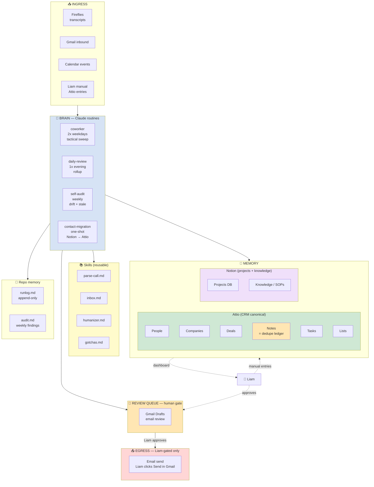

# Desk Monkey Architecture

Designed around one principle: **maximum automation with zero risk of embarrassing sends.** Every send-capable action has an explicit human gate. Routines write to Attio freely (CRM data), draft emails freely, but never send anything externally without Liam's explicit approval.

## TL;DR

- **Two surfaces Liam interacts with:** Attio (CRM dashboard + control) and Gmail (inbox + drafts).
- **Four cloud routines:** `coworker` (2x weekdays, tactical sweep), `daily-review` (1x evening, rollup), `self-audit` (weekly), `contact-migration` (manual one-shot — Notion → Attio).
- **One human review queue:** Gmail Drafts. Liam reviews + clicks Send.
- **Two canonical state stores:** **Attio** (everything customer-facing), **Notion** (projects + knowledge only). Attio Notes double as the dedupe ledger.

## How Liam interacts (read this first)

Liam looks at exactly two places:

### Attio (CRM dashboard + control)
- **Deals** view, sorted by Stage and Last Touch
- **Tasks** view, filtered to assignee=Liam, sorted by deadline (counterpart-owned tasks have empty assignee)
- **People** + **Companies** for relationship lookups
- **Lists** for saved segments (Q2 Pipeline, At-Risk Prospects, AI-Governance Targets, etc.)
- Each Deal page surfaces all attached Notes (the activity log) + linked Tasks + custom Selling With attributes

### Gmail (inbox + drafts)
- **Inbox** — incoming mail, processed via the after-action playbook (see `skills/inbox.md`)
- **Drafts** — email drafts the routines wrote, awaiting Liam's review and Send click

That's it. Liam never reads the runlog, never opens the repo unless changing prompts, never logs into a separate dashboard.

### Daily flow

1. Open Gmail. Inbox has 0-15 items (coworker noise-classification swept the rest). Process each in 30 seconds: action / waiting / reference / archive.
2. Open Attio. Work top-down through Tasks by deadline. Update Deals as conversations evolve.
3. Check Gmail Drafts. Review email drafts. Edit. Click Send.
4. End of day: inbox empty, Tasks dashboard clear of overdue items.

## Top-level data flow



## Ingress: where data enters

| Source | What | How | Read by |
|---|---|---|---|
| Fireflies | meeting transcripts (bot joins via calendar invite, transcribes any platform) | `mcp__Fireflies__fireflies_get_transcripts` | coworker |
| Gmail | inbound emails to deskmonkeyai.com | `mcp__Gmail__search_threads` + `get_thread` | coworker, daily-review |
| Google Calendar | upcoming meetings, accepted invites | `mcp__Google-Calendar__list_events` | coworker, daily-review |
| Attio | manual entries by Liam (Deal updates, Notes, Tasks) | `mcp__Attio__find_record`, `mcp__Attio__list_notes`, `mcp__Attio__list_tasks` | all routines |

## Brain: routines and what each does

### `coworker` — tactical 24h loop
- **Cadence:** 2x weekdays (suggested 8am, 4pm). 2x not 3x to fit Pro plan's 5 routine-runs/day cap.
- **Where:** cloud
- **Reads:** Fireflies (last 36h transcripts), Gmail (inbox last 7d), Calendar (next 24h), Attio (Notes for dedupe + Deal lookup)
- **Writes:** Attio Notes (per transcript / email / meeting brief), Attio Tasks (action items, prep tasks), Attio Deal record updates (high-confidence Selling With attributes), Gmail Drafts (via direct `create_draft` MCP)
- **Skills called:** `parse-call` (per transcript), `humanizer` (per draft body), `inbox` (label per relationship type), `gotchas`
- **Out of scope:** counterpart verification, Deal rollups across multiple activities, prospecting (all in `daily-review`)

### `daily-review` — 1x evening rollup
- **Cadence:** 1x weekday evening (suggested 6:30pm)
- **Where:** cloud
- **Reads:** Attio Tasks (assignee empty + deadline past), Attio Notes (today's), Gmail (proof-of-completion searches), Attio Deals (active early-stage)
- **Writes:** Attio Tasks (mark complete via `update_task`, create nudges), Attio Deal record updates (rolled up from today's Notes), Gmail Drafts (nudge emails). Plus pruned versions of today's first-pass meeting drafts (anti-AI-pacing).
- **Skills called:** `humanizer`, `inbox`, `gotchas`

### `self-audit` — weekly drift detection
- **Cadence:** weekly Sundays 7pm
- **Where:** cloud
- **Reads:** `memory/runlog.md` (last 200 lines only), Attio Deals (stale-Deal sweep)
- **Writes:** `memory/audit.md`, Attio Tasks (stale-deal + critical-bug findings)
- **Skills called:** `humanizer`, `gotchas`

### `contact-migration` — Notion → Attio one-shot
- **Cadence:** manual, run once
- **Where:** cloud
- **Reads:** Notion Contacts DB, Notion Deals DB, Notion Activity Log, Notion DEFCON Tasks
- **Writes:** Attio People + Companies + Deals + Notes + Tasks. After completion, an Attio Note marker captures completion.
- **Skills called:** `gotchas`
- **Idempotency:** check Attio for an existing Note titled `MIGRATION-COMPLETE-<date>` on a "Migration" placeholder record. If present, exit.

## Memory: where state lives

### Attio (CRM canonical)
- **People** (object_id=`people`) — every contact. Custom attributes: title, role, committee role, champion test status, etc.
- **Companies** (object_id=`companies`) — every organization. Custom attributes: industry, employees, last touch.
- **Deals** (object_id=`deals`) — every sales opportunity. Custom attributes: full Selling With set (Stage, Buyer Behavior Stage, Champion Verdict, Champion Tests Passed, Compelling Event, Cost of Doing Nothing, Decision Process, Future State, Deal Evolution, etc.).
- **Notes** (attached to records) — every meeting summary, email digest, call note. Title-prefixed with source ID (`MTG-<fireflies_id>`, `EMAIL-<thread_id>`) for dedupe.
- **Tasks** (linked to records) — every action item. Title-prefixed with `[DEFCON <1-5>] [<Category>] [<Owner>]`.
- **Lists** — saved views/segments.

### Notion (projects + knowledge only)
- **Projects** (`collection://d02e88ab-1d9c-4ee6-a551-23c5b3b1bd2b`) — post-Closed-Won implementation tracking.
- **Knowledge / SOPs** — Selling With method, gap selling, methodology runbooks, ideas.
- **Sales Hub root page** (`5213634e4f454e328cc7bd4ca837001b`) — references the Projects DB. Legacy CRM DBs (Contacts/Deals/Activity Log/DEFCON Tasks) are archived after migration.

### Repo (`memory/`)
- `runlog.md` — append-only run history. Every routine writes a stub at start and a final report at end. Liam doesn't normally read this.
- `audit.md` — weekly self-audit findings. Liam reads this once a week or skips.

### What's NOT in memory
No state.json. No Skill State DB used by routines. No Postgres. The Attio Notes title-prefix dedupe handles "have I processed this?"; audit.md headers handle "did I run this week?"; Attio Migration-Complete Note handles `contact-migration` completion.

## Review queue: human gate between brain and egress

### Gmail Drafts (email)
Routines drop email drafts here via `mcp__Gmail__create_draft`. Liam opens Drafts, reviews, edits, clicks Send. **Routines never call Zapier `Send Email` directly.** That's the only gate that matters.

## Egress: every action that can leave the system

| Action | Tool | Risk | Autonomous? | Gate |
|---|---|---|---|---|
| Create email draft | `mcp__Gmail__create_draft` | low | YES | Liam reviews in Drafts before sending |
| **Send email** | Zapier `Send Email` | **HIGH** | **NO** — routines never call this | Liam clicks Send in Gmail UI |
| **Reply to email** | Zapier `Reply to Email` | **HIGH** | **NO** — routines never call this | (use `create_draft` instead) |
| Add Gmail label | Zapier `Add Label to Email` | low | YES | none |
| Remove Gmail label | Zapier `Remove Label from Email` | low | YES | none |
| Archive Gmail thread | Zapier `Archive Email` | low | YES | none |
| Trash Gmail thread / draft | Zapier `Delete Email` | low (reversible from Trash for 30d) | YES | none |
| Mark Gmail read/unread | Zapier `Mark Read/Unread` | low | YES | none |
| Create Calendar event (no attendees) | `mcp__Google-Calendar__create_event` (attendees field empty) | low | YES | none |
| **Create Calendar event (with attendees)** | `mcp__Google-Calendar__create_event` (attendees populated) | **HIGH** — sends invites | **NO** | Routine creates an Attio Task; Liam creates the event manually |
| Update / delete Calendar event | `mcp__Google-Calendar__update_event` / `delete_event` | MEDIUM — sends notifications | **NO** | Liam-initiated only |
| Respond to Calendar invite | `mcp__Google-Calendar__respond_to_event` | MEDIUM — sends accept/decline | **NO** | Liam-initiated only |
| Create / update Attio Record / Note / Task | `mcp__Attio__*` | low | YES | none |
| Create Notion page (Projects DB only) | `mcp__Notion__notion-create-pages` (parent=Projects) | low | YES | none |

## Risk controls (anti-embarrassing-send)

**No routine, ever, autonomously sends external email or Calendar invite-emails.** Every send goes through a human review gate:

1. **Email** — only via direct `create_draft` MCP. Goes to Gmail Drafts. Liam reviews + clicks Send. Routines never call Zapier `Send Email` or `Reply to Email`.
2. **Calendar invites with attendees** — routines never create these autonomously. They surface an Attio Task ("schedule call with X for Y date") and Liam creates the event manually.

**Other risk mitigations:**
- Drafts always carry the full Liam Glennie signature block (CLAUDE.md voice rules).
- Voice rules ban customer-service openers and demanding language (humanizer.md). Drafts read like a peer asking a peer for help.
- Attio Notes title-prefix dedupe prevents duplicate notes piling up on a Deal.
- Attio Task title-prefix dedupe prevents duplicate Tasks.
- Self-audit catches drift patterns weekly.
- Voice rules require politeness AND brevity AND no AI-writing tells. All three. See `skills/humanizer.md`.

## Skills mapping

| Skill | Used by | What it does |
|---|---|---|
| `humanizer.md` | coworker, daily-review, self-audit | Voice rules + 29 AI patterns to scrub + bad/good examples + signature spec |
| `gotchas.md` | every routine | Hard NEVERs, status lifecycles, dedupe rules, scope boundaries |
| `parse-call.md` | coworker | Fireflies transcript → Attio Note + Tasks + Deal updates + draft email |
| `inbox.md` | coworker, daily-review | Gmail label scheme + after-action playbook + label-by-relationship-type logic |

## Tool routing summary

Direct MCPs primary. Zapier fills the gaps. Use direct for read AND write whenever it exists.

| Surface | Direct MCP | Zapier |
|---|---|---|
| Attio | full CRUD on People / Companies / Deals / Notes / Tasks / Lists | nothing |
| Notion | full CRUD on Projects + knowledge pages | nothing |
| Calendar | full CRUD + invites + suggest_time | nothing |
| Drive | read/create/copy/search/metadata | Share, Delete |
| Apollo | search + enrich + sequences | nothing |
| Fireflies | transcripts + summaries | nothing |
| Gmail | search, read, draft, labels (create/list only) | **Send (gated), Archive, Trash, Mark Read/Unread, Add/Remove per-message Label** |
| Google Contacts | NOT WIRED — Attio handles contact-relationship visibility natively via Gmail integration | NOT NEEDED |

## Schedule

Cron strings live in the Anthropic routine UI, not in this repo. Listed here as documentation of intent.

| Job | Where | Suggested cadence |
|---|---|---|
| coworker | Cloud | 2x weekdays (e.g. 8am, 4pm) |
| daily-review | Cloud | 1x weekday evening (e.g. 6:30pm) |
| self-audit | Cloud | weekly Sundays 7pm |
| contact-migration | Cloud | manual one-shot |

## Repo sync contract

- **Cloud routines:** fresh clone → work → `git add memory/runlog.md memory/audit.md && git commit && git push origin main`. State changes go to Attio (or Notion Projects DB), not git.
- All commits push directly to `main`. No ephemeral session branches.
- **Conflicts:** surface as Drift in runlog. Liam resolves manually.

## Repo structure

```
.
├── CLAUDE.md                         # auto-loaded; voice + tool routing + Attio schema + critical rules
├── README.md                         # operator setup
├── architecture.md                   # this file
├── decisions.md                      # design-decisions log
├── skills/
│   ├── parse-call.md                 # Fireflies transcript handler (called by coworker)
│   ├── inbox.md                      # Gmail label scheme + playbook
│   ├── humanizer.md                  # voice rules + 29 AI patterns + signature spec
│   └── gotchas.md                    # hard rules + dedupe + scope
├── routines/
│   ├── coworker/{prompt.md,README.md}
│   ├── daily-review/{prompt.md,README.md}
│   ├── self-audit/{prompt.md,README.md}
│   └── contact-migration/{prompt.md,README.md}    # Notion → Attio one-shot
└── memory/
    ├── runlog.md                     # append-only
    └── audit.md                      # weekly findings
```

## Anti-dropped-ball logic

Attio Tasks are the action-item ledger. DEFCON priority encoded in title prefix.

**Sources of tasks:**
1. Meeting transcripts (`coworker` → `skills/parse-call.md`) — Liam-owned actions become Tasks (assignee=Liam); counterpart-owned commitments become Tasks with empty assignee + verification path in Notes.
2. Gmail unanswered (`coworker`) — flagged in Attio Note + draft created. Counterpart-silence nudges deferred to `daily-review`.
3. Calendar lookahead (`coworker`) — meeting prep Tasks for tomorrow's externals.
4. Counterpart commitment verification (`daily-review`) — daily check that empty-assignee Tasks past deadline actually got done; if not, creates Liam-owned nudge Tasks.
5. Left-on-read prospecting (`daily-review`) — Deals in active early Stages with no reply >7d get a soft-nudge Task.
6. Stale-deal sweep (`self-audit` weekly) — Deals with no Last Touch in 14d get a Follow-up Task.

**Closing the loop:**
- Liam's view: Attio Tasks filtered to `assignee=Liam AND is_completed=false`, sorted by deadline_at + DEFCON title prefix.
- Done = `is_completed=true`. Killed = decided not to do (encode in Notes). Blocked = waiting on someone, with verification path in description.

## Deal flow (Selling With)

```
New → Discovery → Qualified → POC → Co-Building → Proposal → Negotiation → Procurement → Closed Won/Lost
```

Side states: Nurture, On Hold, Unresponsive.

**Stage gates** (don't auto-flip; daily-review flags when met):
- Qualified gate: 3+ Champion Tests Passed
- Co-Building exit gate: Buyer-Owned Action Ratio ≥ 50%

**Closed Won** spawns a Notion Project page; ongoing implementation activity routes to Notion Projects, not the Attio Deal.
**Closed Lost / no-decision** writes a Deal Review / Autopsy as a Note attached to the Attio Deal.
