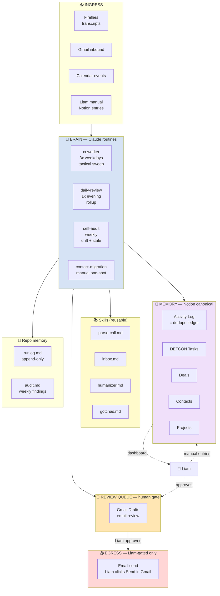

# Desk Monkey Architecture

Designed around one principle: **maximum automation with zero risk of embarrassing sends.** Every send-capable action has an explicit human gate. Routines write to Notion freely, draft emails freely, but never send anything externally without Liam's explicit approval.

## TL;DR

- **Two surfaces Liam interacts with:** Notion (dashboard + control) and Gmail (inbox + drafts).
- **Four cloud routines:** `coworker` (3x weekdays, tactical sweep), `daily-review` (1x evening, rollup), `self-audit` (weekly), `contact-migration` (manual one-shot).
- **One human review queue:** Gmail Drafts. Liam reviews + clicks Send.
- **One canonical state store:** Notion. The Activity Log doubles as the dedupe ledger.

## How Liam interacts (read this first)

Liam looks at exactly two places:

### Notion (dashboard + control)
- **🚨 DEFCON Tasks** (My Open Tasks view) — what needs attention, sorted by DEFCON 1-5
- **🧾 Activity Log** (Status=Open Action filter) — anything else flagged
- **📈 Deals** — Selling With pipeline
- **👤 Contacts** — people directory
- **🛠️ Projects** — post-Closed-Won engagements

### Gmail (inbox + drafts)
- **Inbox** — incoming mail, processed via the after-action playbook (see `skills/inbox.md`)
- **Drafts** — email drafts the routines wrote, awaiting Liam's review and Send click

That's it. Liam never reads the runlog, never opens the repo unless changing prompts, never logs into a separate dashboard.

### Daily flow

1. Open Gmail. Inbox has 0-15 items (coworker noise-classification swept the rest). Process each in 30 seconds: action / waiting / reference / archive.
2. Open Notion DEFCON Tasks. Work top-down by DEFCON.
3. Check Gmail Drafts. Review email drafts. Edit. Click Send.
4. End of day: inbox empty, DEFCON dashboard clear of urgent items.

## Top-level data flow



## Ingress: where data enters

| Source | What | How | Read by |
|---|---|---|---|
| Fireflies | meeting transcripts (bot joins via calendar invite, transcribes any platform) | `mcp__Fireflies__fireflies_get_transcripts` | coworker |
| Gmail | inbound emails to deskmonkeyai.com | `mcp__Gmail__search_threads` + `get_thread` | coworker, daily-review |
| Google Calendar | upcoming meetings, accepted invites | `mcp__Google-Calendar__list_events` | coworker, daily-review |
| Notion | manual entries by Liam (Activity Log rows for ad-hoc notes, Deal updates, etc.) | `mcp__Notion__notion-query-database-view` | all routines |

## Brain: routines and what each does

### `coworker` — tactical 24h loop
- **Cadence:** 2x weekdays (suggested 8am, 4pm). Drops from 3x to 2x to fit Pro plan's 5 routine-runs/day cap (2 coworker + 1 daily-review = 3 weekday runs, leaving 2 ad-hoc slots).
- **Where:** cloud
- **Reads:** Fireflies (last 36h transcripts), Gmail (inbox last 7d), Calendar (next 24h), Notion (Activity Log dedupe)
- **Writes:** Notion Activity Log, Notion DEFCON Tasks, Notion Deal property updates (high-confidence only), Gmail Drafts (via direct `create_draft` MCP), Gmail labels (via Zapier)
- **Skills called:** `parse-call` (per transcript), `humanizer` (per draft body), `inbox` (label per relationship type), `gotchas`
- **Out of scope:** counterpart verification, Deal rollups across multiple activities, prospecting (all in `daily-review`)

### `daily-review` — 1x evening rollup
- **Cadence:** 1x weekday evening (suggested 6:30pm, after the 6pm coworker)
- **Where:** cloud
- **Reads:** Notion DEFCON Tasks (Owner=blank, Due past), Notion Activity Log (today's logged), Gmail (proof-of-completion searches), Notion Deals (active early-stage)
- **Writes:** Notion DEFCON Tasks (mark Done/Blocked, create nudges), Notion Deal property updates (rolled up from today), Gmail Drafts (nudge emails)
- **Skills called:** `humanizer`, `inbox`, `gotchas`

### `self-audit` — weekly drift detection
- **Cadence:** weekly Sundays 7pm
- **Where:** cloud
- **Reads:** `memory/runlog.md` (last 200 lines only), Notion Deals (stale check)
- **Writes:** `memory/audit.md`, Notion DEFCON Tasks (stale-deal + critical-bug findings)
- **Skills called:** `humanizer`, `gotchas`

### `contact-migration` — manual one-shot
- **Cadence:** triggered manually
- **Where:** cloud
- **Reads:** Notion Contacts DB
- **Writes:** Google Contacts (via Zapier), Activity Log (completion marker)
- **Skills called:** `gotchas`

## Memory: where state lives

### Notion (canonical)
- **Activity Log** (`collection://b4edca94-b39f-4f9d-9b29-e53cde7b71c6`) — every interaction logged. Doubles as dedupe ledger: before processing a transcript or thread, query Activity Log for an existing row referencing the source ID. If present, skip.
- **DEFCON Tasks** (`collection://e16abae8-b4c2-4cb1-a41c-0b53a583a44e`) — every action item, with DEFCON 1-5 priority + Owner (blank for counterpart-owned).
- **Deals** (`collection://5f892d2b-0d1d-40e2-a6d0-0cd3be6a83c4`) — Selling With pipeline.
- **Contacts** (`collection://474cee31-b5fe-45e6-906a-b8463eada553`) — people directory.
- **Projects** (`collection://d02e88ab-1d9c-4ee6-a551-23c5b3b1bd2b`) — post-Closed-Won engagements.

### Repo (`memory/`)
- `runlog.md` — append-only run history. Every routine writes a stub at start and a final report at end. Liam doesn't normally read this.
- `audit.md` — weekly self-audit findings. Liam reads this once a week or skips.

### What's NOT in memory
No state.json. No Skill State DB used by routines. No Postgres. The Activity Log handles dedupe; audit.md headers handle "did I run this week"; an Activity Log Note row handles contact-migration completion.

## Review queue: human gate between brain and egress

### Gmail Drafts (email)
Routines drop email drafts here via `mcp__Gmail__create_draft`. Liam opens Drafts, reviews, edits, clicks Send. **Routines never call Zapier `Send Email` directly.** That's the only gate that matters.

## Egress: every action that can leave the system

Every send-capable action and what gates it.

| Action | Tool | Risk | Autonomous? | Gate |
|---|---|---|---|---|
| Create email draft | `mcp__Gmail__create_draft` | low | YES | Liam reviews in Drafts before sending |
| **Send email** | Zapier `Send Email` | **HIGH** | **NO** — routines never call this | Liam clicks Send in Gmail UI |
| **Reply to email** | Zapier `Reply to Email` | **HIGH** | **NO** — routines never call this | (use `create_draft` instead) |
| Add Gmail label | Zapier `Add Label to Email` | low | YES | none |
| Remove Gmail label | Zapier `Remove Label from Email` | low | YES | none |
| Archive Gmail thread | Zapier `Archive Email` | low | YES | none |
| Trash Gmail thread / draft | Zapier `Delete Email` | low (reversible from Trash for 30d) | YES | none |
| Mark Gmail read/unread | Zapier `Mark Read/Unread` | low | YES | none |
| Create Calendar event (no attendees) | `mcp__Google-Calendar__create_event` (attendees field empty) | low | YES | none |
| **Create Calendar event (with attendees)** | `mcp__Google-Calendar__create_event` (attendees populated) | **HIGH** — sends invites | **NO** — routines never auto-create with attendees | Routine creates a DEFCON Task, Liam creates the event manually |
| Update / delete Calendar event | `mcp__Google-Calendar__update_event` / `delete_event` | MEDIUM — sends notifications | **NO** | Liam-initiated only |
| Respond to Calendar invite | `mcp__Google-Calendar__respond_to_event` | MEDIUM — sends accept/decline | **NO** | Liam-initiated only |
| Create / update Notion row | `mcp__Notion__notion-create-pages` / `update-page` | low | YES | none |
| Create / update Google Contact | Zapier `Google Contacts: Create / Update` | low | YES (only in `contact-migration`) | one-shot routine, gated by Activity Log marker |

## Risk controls (anti-embarrassing-send)

**No routine, ever, autonomously sends external email or Calendar invite-emails.** Every send goes through a human review gate:

1. **Email** — only via direct `create_draft` MCP. Goes to Gmail Drafts. Liam reviews + clicks Send. Routines never call Zapier `Send Email` or `Reply to Email`.
2. **Calendar invites with attendees** — routines never create these autonomously. They surface a DEFCON Task ("schedule call with X for Y date") and Liam creates the event manually.

**Other risk mitigations:**
- Drafts always carry the full Liam Glennie signature block (CLAUDE.md voice rules). Reduces "looks like an AI bot" risk.
- Voice rules ban customer-service openers and demanding language. Reduces tone embarrassment.
- Activity Log dedupe prevents duplicate drafts piling up in the same thread.
- Self-audit catches drift patterns weekly.
- Voice rules require politeness AND brevity (not either/or). Drafts read like a peer asking a peer for help, not a boss issuing orders.

## Skills mapping

| Skill | Used by | What it does |
|---|---|---|
| `humanizer.md` | coworker, daily-review, self-audit | Voice rules + bad/good examples + signature spec |
| `gotchas.md` | every routine | Hard NEVERs, status lifecycles, dedupe rules, scope boundaries |
| `parse-call.md` | coworker | Fireflies transcript → Activity Log + DEFCON Tasks + Deal updates + draft email |
| `inbox.md` | coworker, daily-review | Gmail label scheme, after-action playbook, label-by-relationship-type logic |

## Tool routing summary

Direct MCPs primary. Zapier fills gaps. Use direct for read AND write whenever it exists.

| Surface | Direct MCP | Zapier |
|---|---|---|
| Notion | full CRUD | nothing |
| Calendar | full CRUD + invites + suggest_time | nothing |
| Drive | read/create/copy/search/metadata | Share, Delete (only if needed) |
| Apollo | search + enrich + sequences | nothing |
| Fireflies | transcripts + summaries | nothing |
| Gmail | search, read, draft, labels (create/list only) | **Send (gated), Archive, Trash, Mark Read/Unread, Add/Remove per-message Label** |
| Google Contacts | NOT WIRED | **Create, Find, Update** (not yet enabled in Zapier config) |

Currently enabled in Zapier MCP config: Gmail + Google Calendar. Google Contacts not yet enabled (blocking `contact-migration`).

## Schedule

Cron strings live in the Anthropic routine UI, not in this repo. Listed here as documentation of intent.

| Job | Where | Suggested cadence |
|---|---|---|
| coworker | Cloud | 2x weekdays (e.g. 8am, 4pm) |
| daily-review | Cloud | 1x weekday evening (e.g. 6:30pm) |
| self-audit | Cloud | weekly Sundays 7pm |
| contact-migration | Cloud | manual one-shot |

## Repo sync contract

- **Cloud routines:** fresh clone → work → `git add memory/runlog.md memory/audit.md && git commit && git push origin main`. State changes go to Notion, not git.
- All commits push directly to `main`. No ephemeral session branches.
- **Conflicts:** surface as Drift in runlog. Liam resolves manually.

## Repo structure

```
.
├── CLAUDE.md                         # auto-loaded; voice + tool routing + critical rules
├── README.md                         # operator setup
├── architecture.md                   # this file
├── decisions.md                      # design-decisions log
├── skills/
│   ├── parse-call.md                 # Fireflies transcript handler (called by coworker)
│   ├── inbox.md                      # Gmail label scheme + playbook
│   ├── humanizer.md                  # voice rules + signature spec
│   └── gotchas.md                    # hard rules + dedupe + scope
├── routines/
│   ├── coworker/{prompt.md,README.md}
│   ├── daily-review/{prompt.md,README.md}
│   ├── self-audit/{prompt.md,README.md}
│   └── contact-migration/{prompt.md,README.md}
└── memory/
    ├── runlog.md                     # append-only
    └── audit.md                      # weekly findings
```

## Anti-dropped-ball logic

DEFCON Tasks DB is the action-item ledger.

**Sources of tasks:**
1. Meeting transcripts (`coworker` → `skills/parse-call.md`) — Liam-owned actions become Tasks; counterpart-owned commitments also become Tasks with Owner=blank + verification path in Notes.
2. Gmail unanswered (`coworker`) — flagged in Activity Log + draft created. Counterpart-silence nudges deferred to `daily-review`.
3. Calendar lookahead (`coworker`) — meeting prep Tasks for tomorrow's externals.
4. Counterpart commitment verification (`daily-review`) — daily check that counterpart-owned Tasks past Due actually got done; if not, creates Liam-owned nudge Tasks.
5. Left-on-read prospecting (`daily-review`) — Deals in active early Stages with no reply >7d get a soft-nudge Task.
6. Stale-deal sweep (`self-audit` weekly) — Deals with no Last Touch in 14d get a Follow-up Task.

**Closing the loop:**
- Liam's view: 🚨 DEFCON Tasks DB filtered to My Open Tasks, sorted by DEFCON ascending.
- Done = Status=Done. Killed = decided not to do. Blocked = waiting on someone, with Notes explaining what.
- The system never hides Tasks. They sit in Liam's dashboard until acted on.

## Deal flow (Selling With)

```
New → Discovery → Qualified → POC → Co-Building → Proposal → Negotiation → Procurement → Closed Won/Lost
```

Side states: Nurture, On Hold, Unresponsive.

**Stage gates** (don't auto-flip; daily-review flags when met):
- Qualified gate: 3+ Champion Tests Passed
- Co-Building exit gate: Buyer-Owned Action Ratio ≥ 50%

**Closed Won** spawns a Project row; activity routes to Project, not Deal.
**Closed Lost / no-decision** writes a Deal Review / Autopsy on the Deal page.
